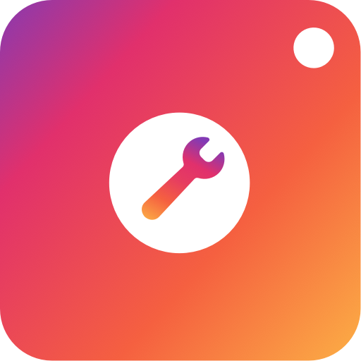

# 
`Instagram Tools`

    
    

&nbsp;
    

> #### Instagram Tools is an application, which aims to comment on hashtags determined by the client
&nbsp;

---

&nbsp;

## 
Introduction

### We believe that a good way to have followers organically would be to promote a certain niche, using hashtags and phrases determined by the customer.

### **Instagram Tools** is at first a public application. In addition to this functionality, this application aims to improve my knowledge.

&nbsp;

## 
Features

- [x] Login system
- [ ] Dashboard Panel
- [ ] Account Generation
- [ ] Automatic Reviews
&nbsp;

## 
Considerations

### This application this application initially runs locally at first, but the goal is to run it in the cloud

